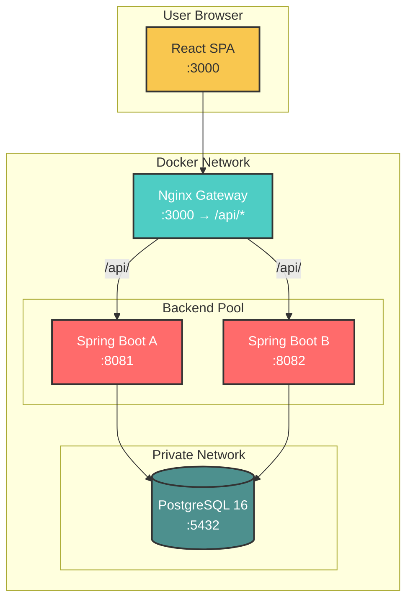

```markdown
<!--
  CloudWare Pro - ERP/CRM/WMS for Wholesale Clothing
  A beautiful, production-ready README for your GitHub repository
-->

<p align="center">
  
  
  
  
  
  
  
</p>

<h1 align="center">
  ☁️ CloudWare Pro
</h1>

<p align="center">
  <strong>A complete ERP / CRM / WMS platform for wholesale clothing businesses</strong><br />
  Mini ERP with multi-warehouse inventory, order lifecycle, payments, reporting, and role-based access.
</p>

<p align="center">
  <a href="#-quick-start">Quick Start</a> •
  <a href="#-features">Features</a> •
  <a href="#-architecture">Architecture</a> •
  <a href="#-api-endpoints">API Endpoints</a> •
  <a href="#-default-credentials">Credentials</a>
</p>

<hr />

## ✨ Features

| | |
|--|--|
| <h3>📦 Inventory & Warehouses</h3><ul><li>Multi-warehouse support</li><li>Stock adjustments & transfers</li><li>Movement history tracking</li><li>Low stock alerts</li></ul> | <h3>🛒 Orders & Payments</h3><ul><li>Full order lifecycle (confirm → ship → deliver)</li><li>Uzbekistan payment methods: PAYME, CLICK, UZUM_BANK, CASH, CARD</li><li>Customer balance tracking</li><li>Order history per customer</li></ul> |
| <h3>📊 Reports & Analytics</h3><ul><li>Sales, revenue & profit reports</li><li>Inventory valuation</li><li>Customer analytics</li><li>CSV export</li></ul> | <h3>🔐 Security & Administration</h3><ul><li>Role-based access (RBAC)</li><li>User management</li><li>Activity audit log</li><li>Notification system</li></ul> |

## 🏗️ Architecture



## 🚀 Quick Start

### Prerequisites
- Docker & Docker Compose
- Git

### Installation

```bash
# Clone the repository
git clone https://github.com/yourusername/cloudeware-pro.git
cd cloudeware-pro

# Build and run all services
docker compose up --build
```

### Access the application

| Service | URL |
|---------|-----|
| Frontend | http://localhost:3000 |
| API Gateway | http://localhost:3000/api |

### Clean start (fresh database)

```bash
docker compose down -v
docker compose up --build
```

## 🔑 Default Credentials

| Role | Email | Password |
|------|-------|----------|
| 👑 **ADMIN** | admin@cloudware.local | admin123 |
| 💼 **SELLER** | seller@cloudware.local | seller123 |
| 📦 **WAREHOUSE_MANAGER** | warehouse@cloudware.local | warehouse123 |
| 🧾 **ACCOUNTANT** | accountant@cloudware.local | accountant123 |
| 👀 **VIEWER** | viewer@cloudware.local | viewer123 |

## 📁 Project Structure

```
cloudeware-pro/
├── backend/                 # Spring Boot application
│   ├── src/main/java/...   # Java source code
│   └── Dockerfile
├── frontend/                # React + TypeScript + Vite
│   ├── src/
│   └── Dockerfile
├── nginx/                   # Nginx configuration
│   └── default.conf
├── docker-compose.yml
└── README.md
```

## 📡 API Endpoints

<details>
<summary><b>Click to expand full API reference</b></summary>

### Authentication
| Method | Endpoint | Description |
|--------|----------|-------------|
| POST | `/api/auth/login` | Login with email/password |
| POST | `/api/auth/logout` | Invalidate session |
| GET | `/api/auth/me` | Get current user profile |

### Products & Categories
| Method | Endpoint | Description |
|--------|----------|-------------|
| GET | `/api/products` | List all products |
| POST | `/api/products` | Create product |
| PUT | `/api/products/{id}` | Update product |
| DELETE | `/api/products/{id}` | Delete product |

### Orders
| Method | Endpoint | Description |
|--------|----------|-------------|
| GET | `/api/orders` | List orders |
| POST | `/api/orders` | Create order |
| POST | `/api/orders/{id}/confirm` | Confirm order |
| POST | `/api/orders/{id}/ship` | Mark as shipped |
| POST | `/api/orders/{id}/deliver` | Mark as delivered |

### Inventory
| Method | Endpoint | Description |
|--------|----------|-------------|
| GET | `/api/inventory` | Current stock levels |
| POST | `/api/inventory/adjust` | Adjust stock |
| POST | `/api/inventory/transfer` | Transfer between warehouses |

### Reports
| Method | Endpoint | Description |
|--------|----------|-------------|
| GET | `/api/reports/sales` | Sales report |
| GET | `/api/reports/revenue` | Revenue report |
| GET | `/api/reports/inventory` | Inventory report |
| GET | `/api/reports/export/sales` | Export to CSV |

</details>

## 🧪 Testing Commands

```bash
# Health check
curl http://localhost:3000/api/health

# Login and get token
curl -X POST http://localhost:3000/api/auth/login \
  -H 'Content-Type: application/json' \
  -d '{"email":"admin@cloudware.local","password":"admin123"}'

# Use token for authenticated requests
TOKEN="your-token-here"
curl -H "Authorization: Bearer $TOKEN" http://localhost:3000/api/products
```

## 📦 Seed Data

On first startup, the application automatically creates:
- ✅ 6 roles with permissions
- ✅ 5 demo users
- ✅ 20 clothing products
- ✅ 10 wholesale customers
- ✅ 3 warehouses
- ✅ 30 inventory records
- ✅ 20 orders with various statuses
- ✅ 10 payments
- ✅ Activity logs & notifications

## ⚠️ Important Notes

> **Security Notice**: This is a **demonstration/diploma project**. Passwords are stored in plain text. For production use, implement:
> - BCrypt password encoding
> - Spring Security with JWT
> - HTTPS configuration
> - Rate limiting
> - SQL injection prevention (though JDBC templates are parameterized)

## 🛠️ Tech Stack

| Category | Technology |
|----------|------------|
| Backend | Java 17, Spring Boot, Spring JDBC |
| Database | PostgreSQL 16 |
| Frontend | React 18, TypeScript, Vite |
| Icons | Lucide React |
| Gateway | Nginx (reverse proxy + SPA serving) |
| Container | Docker & Docker Compose |

## 📄 License

This project is licensed under the MIT License - see the [LICENSE](LICENSE) file for details.

## 🤝 Contributing

Contributions, issues, and feature requests are welcome! Feel free to check the [issues page](https://github.com/yourusername/cloudeware-pro/issues).

---

<p align="center">
  Made with ☕ and ☁️ for wholesale business management
</p>
```
