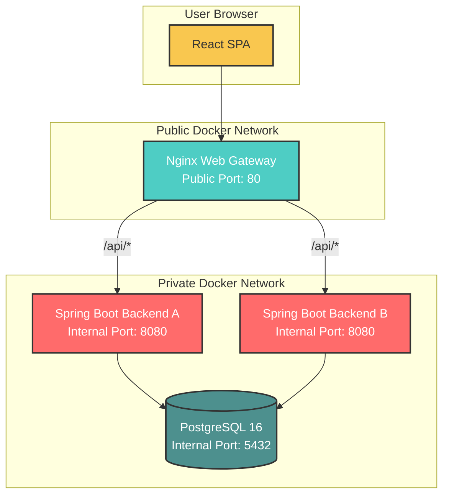

<!--
  CloudWare Pro - ERP/CRM/WMS for Wholesale Clothing
  Production-ready README for GitHub repository
-->

<p align="center">
  
  
  
  
  
  
  
</p>

<h1 align="center">☁️ CloudWare Pro</h1>

<p align="center">
  <strong>A complete ERP / CRM / WMS platform for wholesale clothing businesses</strong><br />
  Mini ERP system with multi-warehouse inventory, order lifecycle, payments, reporting, and role-based access.
</p>

<p align="center">
  <a href="#-quick-start">Quick Start</a> •
  <a href="#-features">Features</a> •
  <a href="#-architecture">Architecture</a> •
  <a href="#-api-endpoints">API Endpoints</a> •
  <a href="#-default-credentials">Credentials</a>
</p>

---

## ✨ Features

| Module | Description |
|---|---|
| 📦 **Inventory & Warehouses** | Multi-warehouse support, stock adjustments, product transfers, movement history tracking, and low-stock alerts. |
| 🛒 **Orders & Payments** | Full order lifecycle from creation to delivery, customer balance tracking, and payment history. |
| 📊 **Reports & Analytics** | Sales reports, revenue statistics, inventory valuation, customer analytics, and CSV export. |
| 🔐 **Security & Administration** | Role-based access control, user management, activity audit log, and notification system. |

---

## 🏗️ Architecture



### Architecture overview

CloudWare Pro uses a container-based architecture with separate public and private network layers.

- **Nginx Web Gateway** serves the React frontend and proxies all `/api/*` requests to the backend pool.
- **Backend A** and **Backend B** run the same Spring Boot application for load balancing and better availability.
- **PostgreSQL** is placed inside the private network and is not exposed directly to public users.
- **Docker Compose** manages the full environment, including services, networks, volumes, and health checks.

---

## 🚀 Quick Start

### Prerequisites

Before running the project, make sure these tools are installed:

- Git
- Docker
- Docker Compose

### Installation

```bash
# Clone the repository
git clone https://github.com/yourusername/cloudware-pro.git

# Go to project folder
cd cloudware-pro

# Build and run all services
docker compose up --build
```

### Access the application

| Service | URL |
|---|---|
| Frontend | `http://localhost` |
| API Gateway | `http://localhost/api` |
| Health Check | `http://localhost/api/health` |

### Clean start with a fresh database

```bash
docker compose down -v
docker compose up --build
```

---

## 🔑 Default Credentials

| Role | Email | Password |
|---|---|---|
| 👑 **ADMIN** | `admin@cloudware.local` | `admin123` |
| 💼 **SELLER** | `seller@cloudware.local` | `seller123` |
| 📦 **WAREHOUSE_MANAGER** | `warehouse@cloudware.local` | `warehouse123` |
| 🧾 **ACCOUNTANT** | `accountant@cloudware.local` | `accountant123` |
| 👀 **VIEWER** | `viewer@cloudware.local` | `viewer123` |

---

## 📁 Project Structure

```text
cloudware-pro/
├── backend/
│   ├── src/main/java/
│   ├── src/main/resources/
│   ├── pom.xml
│   └── Dockerfile
├── frontend/
│   ├── src/
│   ├── index.html
│   ├── package.json
│   ├── nginx.conf
│   └── Dockerfile
├── docker-compose.yml
└── README.md
```

---

## 📡 API Endpoints

<details>
<summary><b>Click to expand the API reference</b></summary>

### Authentication

| Method | Endpoint | Description |
|---|---|---|
| `POST` | `/api/auth/login` | Login with email and password |
| `POST` | `/api/auth/logout` | Logout current user |
| `GET` | `/api/auth/me` | Get current user profile |

### Products

| Method | Endpoint | Description |
|---|---|---|
| `GET` | `/api/products` | List all products |
| `POST` | `/api/products` | Create a new product |
| `PUT` | `/api/products/{id}` | Update product |
| `DELETE` | `/api/products/{id}` | Delete product |

### Customers

| Method | Endpoint | Description |
|---|---|---|
| `GET` | `/api/customers` | List customers |
| `POST` | `/api/customers` | Create customer |
| `GET` | `/api/customers/{id}` | Get customer details |
| `PUT` | `/api/customers/{id}` | Update customer |

### Orders

| Method | Endpoint | Description |
|---|---|---|
| `GET` | `/api/orders` | List orders |
| `POST` | `/api/orders` | Create order |
| `POST` | `/api/orders/{id}/confirm` | Confirm order |
| `POST` | `/api/orders/{id}/ship` | Mark order as shipped |
| `POST` | `/api/orders/{id}/deliver` | Mark order as delivered |
| `POST` | `/api/orders/{id}/cancel` | Cancel order |

### Inventory

| Method | Endpoint | Description |
|---|---|---|
| `GET` | `/api/inventory` | View current stock levels |
| `POST` | `/api/inventory/adjust` | Adjust stock quantity |
| `POST` | `/api/inventory/transfer` | Transfer stock between warehouses |
| `GET` | `/api/inventory/movements` | View inventory movement history |

### Payments

| Method | Endpoint | Description |
|---|---|---|
| `GET` | `/api/payments` | List payments |
| `POST` | `/api/payments` | Create payment |
| `GET` | `/api/payments/customer/{customerId}` | Get customer payment history |

### Reports

| Method | Endpoint | Description |
|---|---|---|
| `GET` | `/api/reports/sales` | Sales report |
| `GET` | `/api/reports/revenue` | Revenue report |
| `GET` | `/api/reports/inventory` | Inventory report |
| `GET` | `/api/reports/export/sales` | Export sales report to CSV |

</details>

---

## 🧪 Testing Commands

### Health check

```bash
curl http://localhost/api/health
```

### Login and get token

```bash
curl -X POST http://localhost/api/auth/login \
  -H "Content-Type: application/json" \
  -d '{"email":"admin@cloudware.local","password":"admin123"}'
```

### Use token for authenticated requests

```bash
TOKEN="your-token-here"

curl -H "Authorization: Bearer $TOKEN" \
  http://localhost/api/products
```

### Check running containers

```bash
docker compose ps
```

### View logs

```bash
docker compose logs -f
```

### View specific service logs

```bash
docker compose logs -f backend-a
docker compose logs -f backend-b
docker compose logs -f web-gateway
docker compose logs -f postgres
```

---

## 📦 Seed Data

On first startup, the application automatically creates demo data:

- ✅ Roles and permissions
- ✅ Demo users
- ✅ Clothing products
- ✅ Wholesale customers
- ✅ Warehouses
- ✅ Inventory records
- ✅ Orders with different statuses
- ✅ Payments
- ✅ Activity logs
- ✅ Notifications

---

## 🌐 Deployment Notes

CloudWare Pro can be deployed on a cloud virtual machine such as AWS EC2.

Basic deployment flow:

```bash
# Copy project to server
scp -r cloudware-pro ubuntu@your-server-ip:/home/ubuntu/

# Connect to server
ssh ubuntu@your-server-ip

# Go to project folder
cd cloudware-pro

# Run project
docker compose up --build -d
```

After deployment, the application will be available through the public server IP:

```text
http://your-server-ip
```

---

## ⚠️ Important Security Notes

This project is created as an educational / demonstration project. Before real production usage, the following improvements are recommended:

- Use BCrypt password hashing.
- Add Spring Security with JWT access and refresh tokens.
- Enable HTTPS with SSL certificate.
- Add rate limiting for login and API requests.
- Store secrets in environment variables.
- Add database backup strategy.
- Restrict database access to the private network only.
- Add monitoring and centralized logging.

---

## 🛠️ Tech Stack

| Category | Technology |
|---|---|
| Backend | Java 17, Spring Boot 3, Spring JDBC |
| Database | PostgreSQL 16 |
| Frontend | React 18, TypeScript, Vite |
| UI Icons | Lucide React |
| Gateway | Nginx reverse proxy and SPA server |
| Containerization | Docker and Docker Compose |
| Deployment | AWS EC2 / Linux VM |

---

## ✅ Production Improvement Ideas

Future improvements can include:

- CI/CD pipeline with GitHub Actions
- Automated tests for backend and frontend
- Horizontal scaling with more backend containers
- Load balancer in front of Nginx
- Redis caching
- Object storage for files and invoices
- Real-time notifications with WebSocket
- Full audit dashboard
- Automated PostgreSQL backups

---

## 📄 License

This project is created for educational and demonstration purposes.

---

<p align="center">
  Made with ☕ and ☁️ for wholesale business management
</p>
